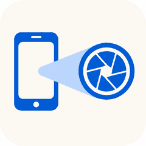

# BeamCam

Use an Android phone as a webcam on macOS. One Flutter codebase, two roles: the
phone captures and sends, the Mac receives and displays.

## Why this exists

Every open-source Android→webcam project on macOS routes video through OBS.
[droidcam-obs-plugin](https://github.com/dev47apps/droidcam-obs-plugin) is an OBS
plugin with a closed-source phone app.
[RemoteCam](https://github.com/Ruddle/RemoteCam) is MJPEG-over-HTTP into an OBS
media source. [Mobile-Webcam](https://github.com/soubhagyajit/Mobile-Webcam)
ships a real virtual camera but only on Windows. Iriun and Camo do the whole job
natively and are both closed source.

Nothing open-source delivers Android → **native macOS virtual camera**.

Note this is deliberately Android-only. macOS has shipped Continuity Camera
since macOS 13, so an iPhone already does this natively and better. Android is
the case Apple will not serve.

## Status

| Stage | What it does | State |
|---|---|---|
| 1 | Phone captures, Mac receives and renders over WebRTC | **working** |
| 2 | CoreMediaIO extension so Meet/Brave list it directly | **installed and enabled** |
| 3 | Background capture, pinned rotation | **working** |
| 4 | Frame bridge: received video → extension sink stream | **working** |
| 5 | Torch/zoom/focus, bitrate tuning | not started |

`system_profiler SPCameraDataType` lists **BeamCam** as a capture device and it
serves the phone's live feed at 1280×720/30fps. The placeholder (dark frame,
moving blue bar) now appears only when no frame has arrived for 2 seconds — i.e.
when the phone is disconnected.


```swift
CMIOObjectSetPropertyData(kCMIOObjectSystemObject,
                          kCMIOHardwarePropertyAllowScreenCaptureDevices = 1)
```


## Architecture

```
Android (sender)                          macOS (receiver)
────────────────                          ────────────────
getUserMedia                              HttpServer :8787
     │                                          │
RotationPinner (native)                    WebSocket /ws
     │                                          │
RTCPeerConnection ──── offer ───────────▶       │
     │              ◀─── answer ─────────       │
     │              ◀──▶ ICE trickle ────▶      │
     │                                          │
     └──── SRTP video, direct over LAN ───▶ RTCVideoRenderer
```

The phone is always the offerer since it owns the media. The Mac adds a
`RecvOnly` transceiver and answers. `iceServers` is empty on purpose: both peers
are on one subnet, so host candidates pair immediately and STUN would only add
gathering latency.

| File | Role |
|---|---|
| `lib/signaling.dart` | Wire format, port, ICE config — shared by both ends |
| `lib/sender_page.dart` | Android: camera, framing, quality, background toggle |
| `lib/receiver_page.dart` | macOS: signaling server, answer, extension install UI |
| `android/.../RotationPinner.kt` | Freezes the outgoing rotation tag |
| `android/.../BeamCamService.kt` | Opt-in foreground service for background capture |
| `macos/CameraExtension/` | CoreMediaIO provider, device, source + sink streams |
| `macos/add_camera_extension.rb` | Recreates the extension target in the Xcode project |


## To do

- [ ] **iOS sender.** Worth a lot against a Windows receiver.
- [ ] **Windows receiver.** Needs a Media Foundation camera; CoreMediaIO is Apple-only.
- [ ] **More quality options.** 1440p, and a manual bitrate override.
- [ ] **Microphone relaying.** Needs a virtual audio device, separate from the camera.

## License

GPL-3.0. See [LICENSE](LICENSE).

Use it however you like — the licence only has anything to
say when you *distribute*. Ship a modified version to anyone else and you have
to ship its source too, under the same licence. That is deliberate: the point is
that the CoreMediaIO work here cannot be quietly absorbed into a closed product.

Contributions are accepted under GPL-3.0 plus a maintainer relicensing grant,
so that app-store distribution — which GPL-3.0 terms forbid — stays possible
for the project's own releases. That grant is to the maintainer alone and
extends to nobody else. See [CONTRIBUTING.md](CONTRIBUTING.md).
